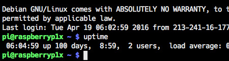

100 days of Raspberry Pi server

Our main web server - the Raspberry Pi B - celebrates 100 days of constant running! It serves much longer but after adding real UPS to it I never restarted it since.
And today during maintanance work on I type 'uptime' just for curiosity.

Yes, Raspberry Pi @raspbarian is very, very stable. It serves only few PHP/HTML light pages. But still it's impressive to see this little computer doing it's job well done. All without any hassle.

To celebrate this event I did the full backup! Guess when was the last time I did one ;) But it was not an ordinary backup - I did an image of the entire SD card on-the-fly. Image was writing to the external SD card of another Raspberry Pi.. and in the end pushed to the Dropbox. I read [this article](http://cagewebdev.com/index.php/raspberry-pi-creating-a-backup-image-while-the-raspberry-pi-is-running) about this method. It runs flawlessly.

Tags: raspberry-pi, server, linux
