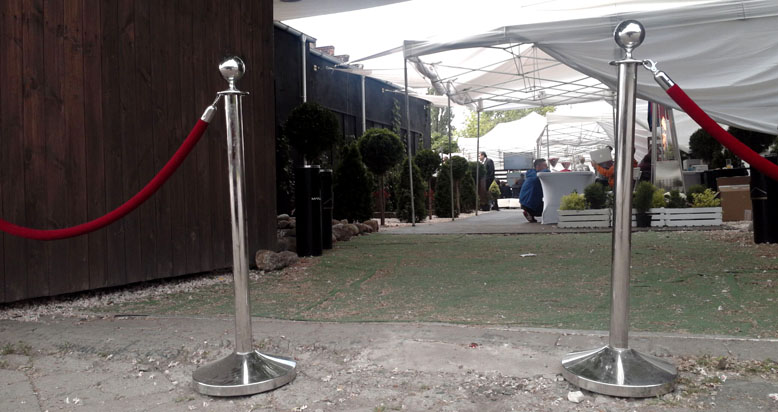
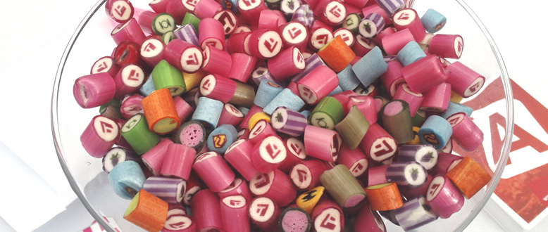
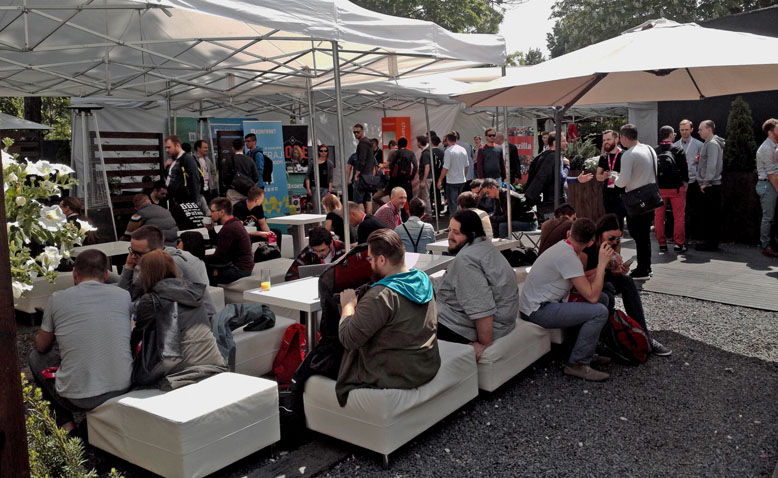
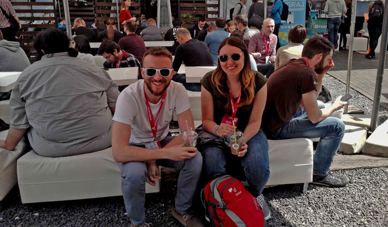
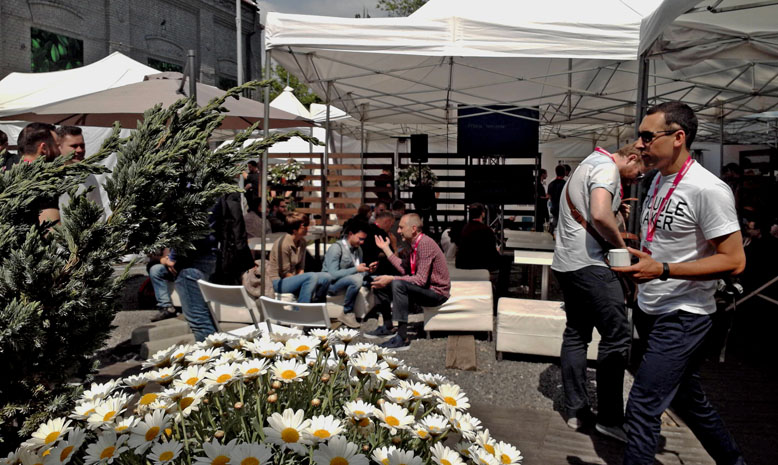
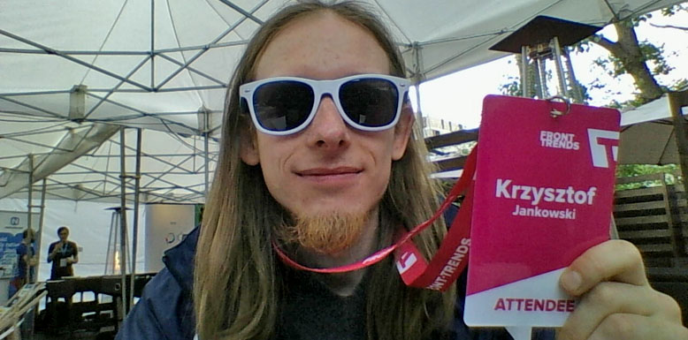
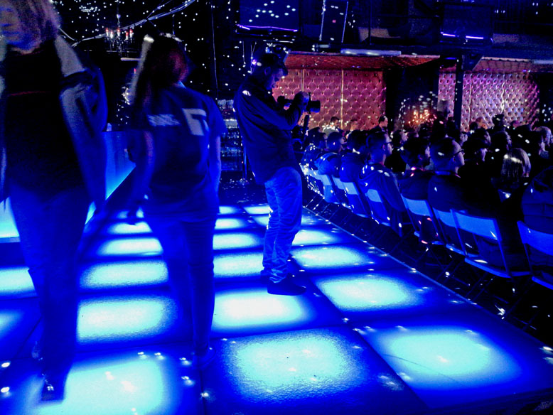
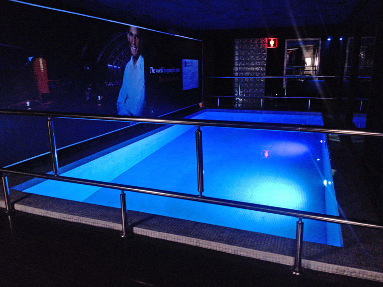

Front Trends 2016

It's my first time at [Front Trends](http://https://2016.front-trends.com) a conference for javascript (front-end) developers. So far its one of the best I've been.

Right from the begining we were suprised that there are no lines for register. It was organized very well and runs smoothly. So in few seconds we were at the place, registered and ready for action!

## The place

As we all know programmers are good at pilkarzyki (table soccer). Every good company have those in house. So one of the sponsors bgings two tabels and invite the best teams for little championship.

Our team lose in semi-finals.

I'm realy glad they give us ability to watch talks while being outside chilling. So i personaly take all the chances to get some sun.

## The bag

Each conference needs a hipster bag with little _presents_ (read: cheap promotional materials).

Front Trends was not an exeption. We get a bag and.. shades from WordPress :) Better than yet another pen and notes. What I love the most are those little pink stickers (3D/bumped)!

## The food

The food were simply awesome. It was the first event where there are more vegan food that the one with dead animals in it. Also I'm very suprised that there were no fries, potatos or other low quality stuff. Instead I ate rice, ciecierzyca, szparagi, etc.

Yes, food is !important.

## The talks

I was very sceptic about this. I do not like the "trends" and other bullshit in developer world. I was also afraid that there will be more soft talking than hard facts and practises.

How wrong I was. There were still one or two boring talks but overall the bar was set very high. Talks so far have good balance between being technical with all the real examples and interesting to the more creative minds.

Creativity and inspiration. Those two words came to my mind. There were even talks about Arduino/hardware hacking and live demoscene creation in JS!

Also stuff I'm somehow related to: SourceJS (what I did rescently at work), Angular2 (what I will be doing in future) and static websites architecture (like this blog for example).

Everyone find something intresting.

## The good, the bad and the ugly

Keynotes that I feel were _realy good_:

- **The Web In Motion** by Rachel Nabors
- **Static Sites Go All Hollywood** by Phil Hawksworth
- **Demo Reel & Tiny JavaScript** by Mthieu Henri
- **Syntax Highlight Everything** by Kenneth Ormandy
- **Computer Assisted Arts and Crafts** by Mariko Kosaka
- **Talking over the web platform with Angular 2** by Todd Motto
- **CSS fo software Engineers for CSS Developers** by Harry Bartlett

And just look at this list. Normaly I point out two, max three talks that I remember and recommend. Now the list grows every day. And the other talks was still good but just not interesting for me personaly.

The _bad_ thing was that there were no free bear.. But we have a pool!

The weather were not-so-perfect. First day was very cold and rainy, second with lot of clear sky and sun but cold, cold winds. This helpfuly changed on the last day to perfect summer day :)

And to be honest, the only _ugly_ thing I recal was the toilets. And lets forget about this.

## Afterparty

This was epic. We drank, we network and we all admire the aww droppnig view of Warsaw at the sunset.n

## Fame & Camera replacement

I was recognized by some guy as "that game developer". We chat about Godot being superior to the Unity3D. That was nice.

This time I did not take any camera with me. I did not even have a smartphone.
So to document this event I was using my Dell (7204) in tablet mode. This (alogn with the acutal dell look) gather a lot of attention. First of all I was the only crazy dude that make photos using some big and bulky "thing". Second, I was the only one that use non-Apple laptop :)

So yes, all photos here are made using a linux laptop.

Tags: events, javascript