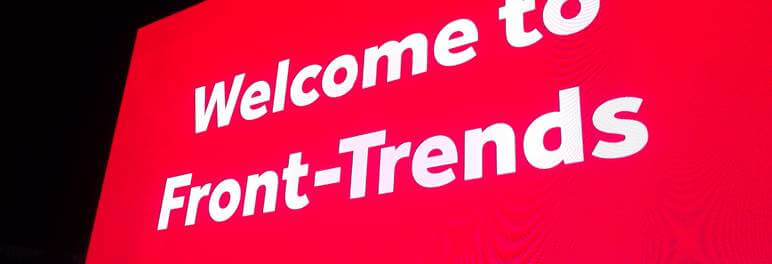
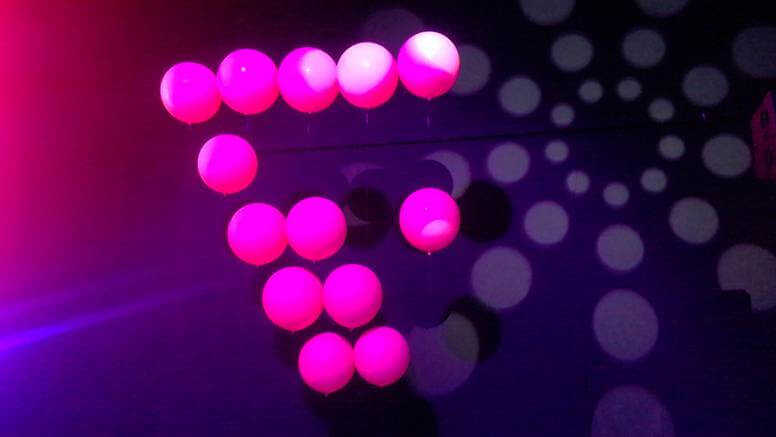
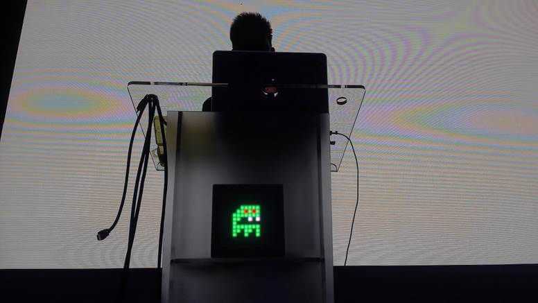
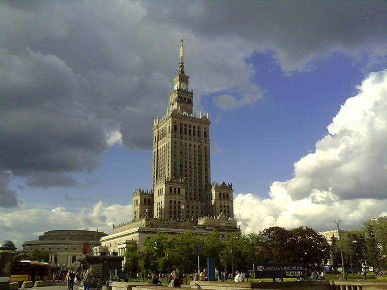

Front-Trends 2017 Or How I will-change

[Front-Trends](http://https://2017.front-trends.com) is in my opinion one of the best conferences for web developers in Poland. It has it's ups and downs but overall quality is always high.

This year there it was less awesome than year ago but still I learn something, get inspired and spend a nice four days in Warsaw.

## Venue

Meh. In 2016 it was epic place, this time it was just a big hangar. No TV outside to watch talks. Only few sunbeds to sit. And garden umbrellas that were closed most of the time. Another thing I missed from last year was lack of comfortable sits in the main room. Sad but true. 

Just look at the picture below.

## Food && Drinks

As always delicious and vegan friendly. At last this doesn't change.

## Talks

Enough of the hate. It's time for commenting on the main and most important thing - talks. Overall professional and at high level. I selected most interesting ones so you can watch them when they become available on the web sometime in the future.

## Highlights

- The Power of CSS - Lot of code examples and an important tip to use 'will-change' property.
- Field-tested interfaces For the Next Billion - most people on the web have low spec android with little to no internet access (and electricity)
- Alternative Reality DevTools - grate ideas for the future of browsers developer tools
- Rendering Performance Inside Out - a lot of valuable knowledge about rendering and detailed information how 'will-change' works
- Easy and Affordable User-Testing - a few interesting tips for easy testing apps with real users
- Changing the Layout Game - a lot of code examples and CSS hacks!

Besides some awesome talks there was one particular thing that I recognize - a lot of (front-end) girls. It's known that IT conferences are mostly a guy things. But this year there was a huge diversity. I thing at last one third was women. This is a big step up. We can be proud of it.

## Missing Parts

Each year there is some kind of micro-controllers talk(s). This time it was named IoT to be more trendy. They're not front-end related but gives a nice and light pause between more hardcore talks. Each time I listening to any kind of IoT lecture and hope for some security advices. It was sad that we all know that this is a problem but to this day I did not hear of any resolution for this. What was hilarious is that someone hijack internet enabled drone live on stage. And try to fly it away. Security. Yeah.

Another thing that I missed was lack of highly technical talks and code examples. Year ago there was even live coding. This time it was more talk and confusing charts. Some times it was so low tech that we feel offended. In a room full of professional developers we saw tutorial how to make a web page as icon on your smartphone or how to use RGB values to change colors of a pixel. In 2017.

## Fun Parts

Right at the beginning at the registration booth I was asked if I'm the guy with the 'big, strange laptop?' :) So yes, I become recognized by my DELL Rugged Extreme computer that I use to make photos at conferences.

As usualy the Code Wise provides beer. This time they made custom bottles! How cool is that?

## Summary

It wasn't perfect but overall I spend a nice three days in Warsaw. I learn something new witch is the main purpose of the conference. I meet lot of people from last year. I eat good food. I certainly come back next year.

Tags: events, javascript
