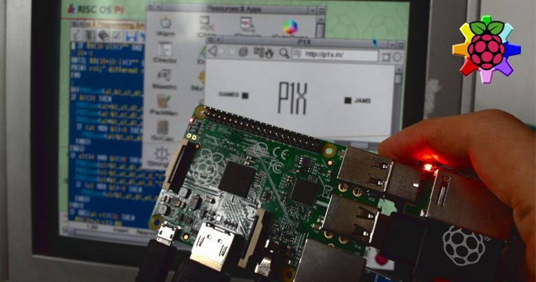
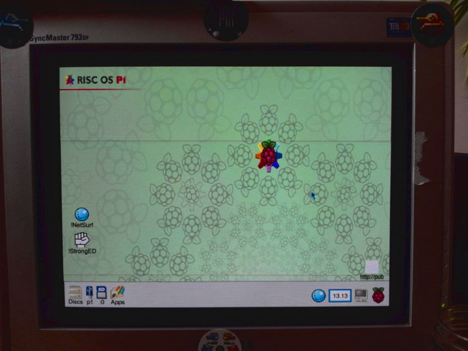
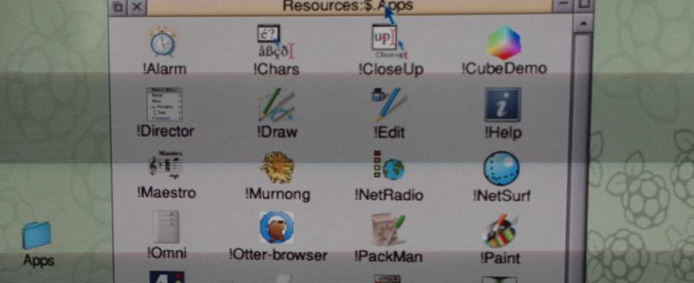
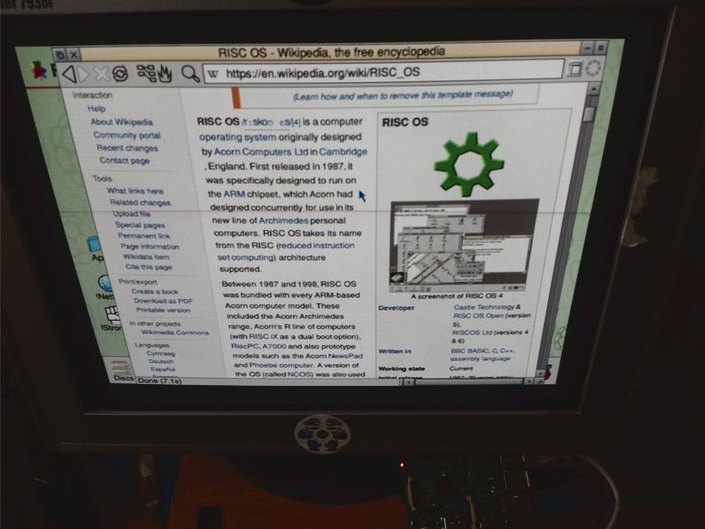
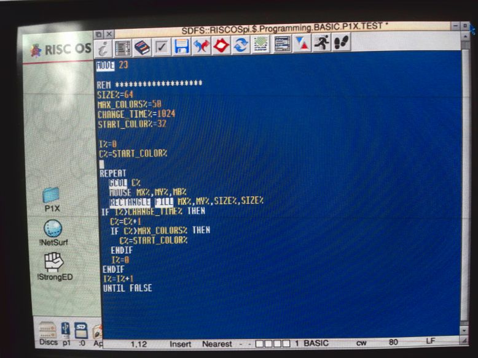
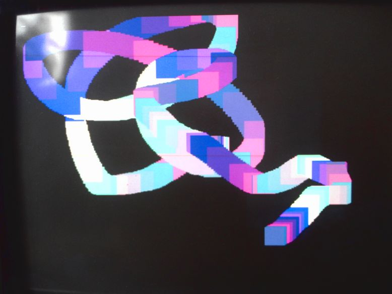
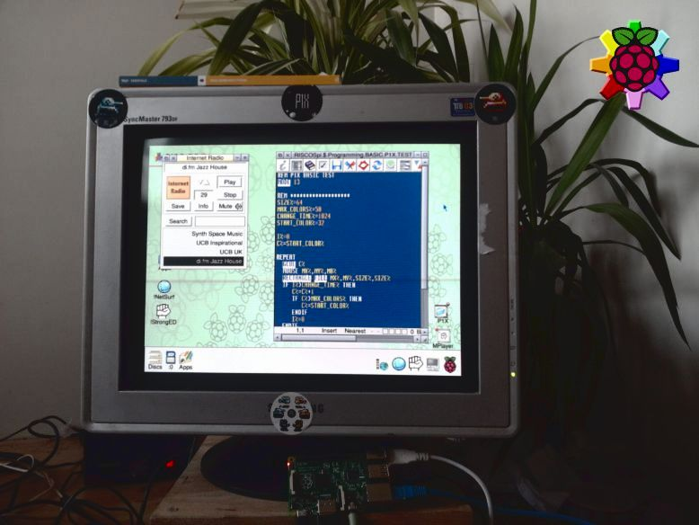

Fun With BASIC on RISC OS Pi

I put latest beta build of RISC OS Pi into my Raspberry Pi B. And then the BBC BASIC fun begins!

## RISC OS Pi

You may wander, "What is RISC OS?".

It's an Operating System that has it's roots in the beginning of Personal Computers. But that can be sad about all OSes. What is most important is that RISC OS was made exclusively for RISC processor - ARM. Exactly the same processor that runs Raspberry Pi's. This gives RISC OS one of the biggest advantages: it's fast and super light. It's the smoothest OS available for RPi right now.

Disclaimer. I'm thinking of a computer as a box that can do the basic, *primary* things like word processing, spreadsheets, graphics and audio manipulation. The javascript-heavy social media sites are not in that list.

RISC OS Pi is a latest version of the RISC OS Open (5.23) that is dedicated to run on Raspberry Pi hardware. I tested only on model B+. The version 3 is not yet supported but according to developers work on it is almost done.

Yes, the OS is still in development. The community is alive. There are even annual events in UK! I hope I can attend one of those in the future.

Overall the OS looks very familiar. It has "dock" and "windows" and "desktop". All named differently here but basically it's how it all started. everything is drag-and-drop friendly. Sometimes to this point that it looks silly in our times. But it's all consistent and easy to understand.

## Similarities

Programs are just icons with a disclaimer in the name. !Draw, !Paint, !Write. 

To install an app is to put it in some directory. Looks very familiar to all macOS/iOS users.

## Web

The biggest drawback is lack of modern web browser. Default !NetSurf browser is fast but not user friendly. And it do not support JavaScript nor latest CSS.

In other hands we have modern browsers on Raspberry Pi and once you enable all the latest features they all starts to work very slow. So at last !NetSurf works fast all the time just not rendering all those hipster pages correctly. But most of the time you get the information but with bad rendered background or broken layout.

Searching Wikipedia works perfect.

## Media

I was able to play mp3 files and stream Digitally Imported radio with no trouble. Videos was clearly not accelerated and can't handle even low resolution. Back in the day there were no DivX nor HD :)

## Applications

RISC OS Pi comes with some basic programs. But to get all of it you need more. And to get apps there are two sources: !PackMan and !Store. One for free and one for more commercial stuff.

## Overall

Looking at pros like speed, productivity, simplicity and cons like unable to play YouTube videos I think RISC OS Pi is a big win here.

Comparing to the Ubuntu, Fedora, Pidora, DietPi, Raspbian... They all feels sluggish and unfinished. RISC OS feels mature, stable and consistent. For word processing, Wikipedia, calculations, music, fun with programming - it is superb.

For such a small and cheap thing like Raspberry Pi it's marvelous.

## BBC BASIC

I'm a game developer. I love to code games. I started long, long time ago on Microsoft QBASIC in DOS. I made my first games then. And now, almost 20 years later I can back to the good-old-days. Sit behind a glowing CRT and just enjoy making simple experiments. BASIC is simple but has build in all the stuff game developer needs.

First thing I always make in BASIC is drawing colorful boxes using mouse. I dont know why but this is oddly satisfying to test :)

God, how fast this BBC BASIC is running on RISC OS Pi. The default editor isn't perfect but the executed code runs smoothly and without any hassle.

## The Long-term Idea

I want to create a simple game that I can port thru different platforms/OSes. And for first platform I choose RISC OS Pi / BBC BASIC. It will be fun!

The game will be abstract, short, easy to start. With easy adding of second player (for Arcade). An there will be a leaderboard.

## Conclusion

This is one of the best use of Raspberry Pi I experience so far.

Pure enjoinment for a geek like me and a lot of fun for a game developer like me. The ideal platform for long, fall evenings.

As a bonus I learned a lot about Arcon, BBC computers, the OS itself.

Tags: raspberry-pi, risc-os, basic
