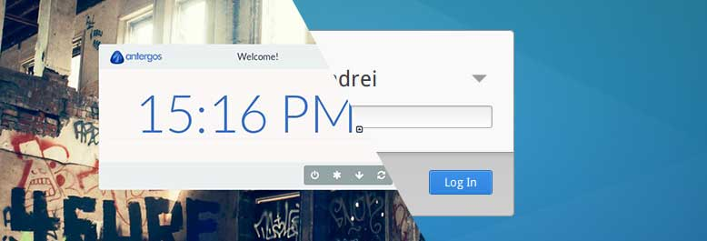

How I broke and fix my linux distro

One day (yesterday) after waking up the laptop I found out that something is wrong. The login manager was corrupted. Whenever I press spacebar or clik on my login name it crashes (black screen, white screen) and then starts over. So basicly I can not login to the system.

## Panic

First toughts was as always - panic that yet another update broke my system. I did not know what was wrong. This mean reinstall for me. But I have too much stuff already set up to just do it all over again. So I decidet to at last try to investigate.

## Investigation

I was able to swith to the console at F1. From there when I run `startx` I get fwm and some terminals open. Good I have at last working sytem. I edited the X init stript and change `fwm` to `gnome-session`. Restart the X. 

System (X/Gnome) works as nothing happened. So now I was certain that the broken part is login manager.

I found out I have lightDM installed with some eyecandy greeter. And this is probably the source of problems. I have Webkit2 greeter instaled. And there are also (available) GTK+, Unity and KDE. GTK+ looks much lighter than Webkit.

## Fix

I just remove all lightDM packages. And then install lightDM + GTK+ greeter + configurator for X.

System restart...

It works! Now I have new greeter that is much better. Who need all those funcy stuff? I just want to type my password. No more no less.

## Conslusion

Never panic. Try to get what is working and what not. Remember that linux always have [ctrl][alt][f*] consoles in the "background". 

And the best thing about all this is that after configuring GTK+ greeter it looks better and runs faster than before (Webkit). It's simple and elegant. And just works.

Another good day in my (new) linux life as a developer :)

Tags: linux, arch
