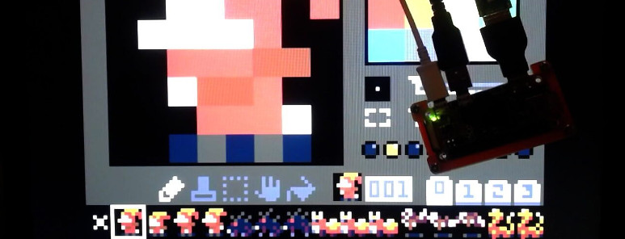

(What I Love in) Pico-8 Fantasy Console

# Introduction
Pico-8 is a new player in the game engines war. But instead of fighting for better graphics than UE4 or for having more plugins than Unity it's just a simple, cute and nostalgic game creation environment.

Its simplicity and integrated tools are the most distinctive strengths. This will not be the full review nor tutorial. I'll just highlight the best parts of it after some time of use.

# Restrictions

Pico-8 have strict restrictions like 8x8 sprites, 32KB cartridge size for code, gfx, sfx and maps. Only one, 128x128 screen resolution and simplified LUA code base. But thanks to this it's super easy to make game and final binary will run on almost any computer including Raspberry Pi Zero!

The code reminds me of BASIC from 8bit computers. And brings memories from my childhood when I did my first programming on 486 PC. Looking at today's trends people like this approach.

# Complete Toolkit

Pico-8 is a complete package: code editor (and compiler), pixel art editor, map editor, sampler and music composer. All of this for only $15. Yes, it's not free. But good things costs. And considering that you will be able to create a full game using one application it's a small price. I don't know of any other game engine that have that ability.

# True Pixel Art Heaven

Graphics in Pico-8 are inspired by 8-bit era (hence the name). Screen size is always 128x128 and sprites are based on 8x8 grid. Also there are only 16 colors to choose from.

For me this is a perfect setup as I always use 16 or 32 palette for my art. I normally make sprites 16x16 (or more) but I did a lot of art in 8x8 in the past. And restricting size and palette is good for practicing. It force you to re-think and come up with all the tricks to make the sprite recognizable while good looking.

In daily developing I'm using Aseprite as my go to graphics editor. Pico-8 have own, build-in editor. I's not that powerful but still much better than most of the competition. It's simple but have all the tools needed for pixel art.

# Good Manual and BASIC Like Language

One of the fundamental things about game engines are manual. Without it it's unnecessary harder to develop. I'm looking at you - Godot Engine. But on the other hand when manual is too big and too complicated it scares junior developers.

Pico-8 manual thanks to it's simple language is short and straightforward. Covers all functions and engine capabilities. It's a very good base at learning new language.

Language itself is highly BASIC inspired but uses LUA simplified syntax. It's changed mostly to fit small screen estate of the (built-in) editor. Also it have all the functions to do graphics and music things. Putting a pixel or a sprite ona screen is as easy and pleasing as in BASIC.

Why I love BASIC languages? Because right after I open the environment I can write few lines of code and have something on the screen. Doing this, drawing pixel art sprites, on modern engines is harder than it should and requires lot of configuring. It's not just "put a sprite on x and y. I need to import sprite (from external editor), make some node with sprite object, configure it to show me that file. Then configure engine to have proper resolution and not blurring the sprites. And all this uses so much processing power as under the hood there's still sophisticated engine. For 8-bit kind of games it's over-engineering. That's why Pico-8 wins in this scenario. It looses badly if you want to make anything 3D or vector. But that's why we have special tools for special needs.

Pico-8 is perfect for simple, pixel art games (and programs). Also small games
are easier to do and maintain. And finish ;)

# Exporting and Sharing

Exporting finished game and sharing the process of it's creation from the Pico-8 is a dream. It has everything I ever wanted to have in a game engine.

I can make screenshots in on simple click. I can make game cover in another. But that's nothing special. But then it goes to 11. I can make GIFs very simple. This one feature is so useful and unseen in any other engine.
Normally making GIFs from game is unnecessary complicated process involving few applications and few rendering times. In Pico-8 I just set a starting mark and then end it with a hotkey. After that immediately I have a pixel perfect GIF to share. Brilliantly simple and useful. Why no other tool have that? It's one of those little details that makes **big** differences.

Another cool thing is extremely simple exporting to JavaScript/web. One command and I have two files ready to be pushed to the server. And from my testing it works on every OS, browser and device I tested. I know it's only a 32KB simple programs but still - export to HTML5 works as a charm and that's a good thing. I know engines that still have trouble with this (Godot) or requires a stupid plugin (Unity).

And the last but most awesome thing is exporting the cartridge (Pico-8 game) as a PNG file! Yes. The files are so small that they can be embedded into the PNG file itself. So the file is a .png that opens as a image of a cover with description. But when opened in Pico-8 they works as a proper cartridge - runs an embedded game (The image above this paragraph is an actual cartridge you can run). It's so brilliantly cool :)

As a bonus, the Pico-8 cartridges (.p8 not .png) are git friendly. Basically any text editor friendly. They are just  a plain text divided by the code, graphics, map and music. Once again simple and easy to maintain.

# Publishing

The Pico-8 have build in game browser - just like App Store in iOS devices. Anyone can publish and all those games are open-source. So anyone can look at the code, learn from it and modify for fun and experiment. This feature is always advertising as a key thing.

For me it's just a nice thing to have as I don't use it often. But that doesn't mean it's not needed. Anyone less skilled will appreciate it. And whatever people will use it or not it teaches developers that open-source is a good and needed thing.

# Raspberry Pi Zero Console

Last thing I want to mention is that Pico-8 runs on Raspberry Pi. Also the Pi Zero. And community made a special distribution (super small) that change the Pi to the little console. It boots directly to the Pico-8 (in a few seconds!) and supports Xbox controllers out of the box.

Full setup contains Pi Zero + XBox retriever and whole thing connected to the monitor. And that's it. Power up and I have a Pico-8 console ready to play. I will provide this on each trade shows we (P1X Team) show up from now on. And we usually do 2-3 in a year. The closest one will be in April (Pyrkon).

I just mention this because it's impossible to do this kind of (cheap) console for Godot, Unity or Unreal Engine. Another small win for Pico-8.

# Sound

This fantasy console have a fully featured sequencer and synthesizer for
chip tunes. But I'm not a musician and can't compare nor review it properly. I
can make sample sound effects for my games and that's great. In the past I use
mostly xsfr and this is kind of similar. And once again - it's build in so no
external tools are needed.

# Conclusion

It seems like the Pico-8 is the best game engine out there. No it's not. But it's one of the most solid ones. And for 8bit games with pixel art graphics (and chip tune sound) it's the one that will just work.

I just love to make some small experiments/prototypes in Pico-8 in the free time. It's so simple and just works as intended.

I can easily share GIFs to the awesome twitter community. When I finish my first completed game I will publish it to the Pico-8 console itself so any one can play. I already test this feature for the Work In Progress category and it was easy and fast.

Graphics restrictions pushes my pixel art skill to the limit and beyond. I learn a lot trying to fit my vision in those few pixels and code limitations.

For anyone that wants to make first steps in game development or veterans that want something small and simple to play in the evenings I **highly recommend Pico-8**.

Tags: pixel-art, pico-8, game-development, raspberry-pi
