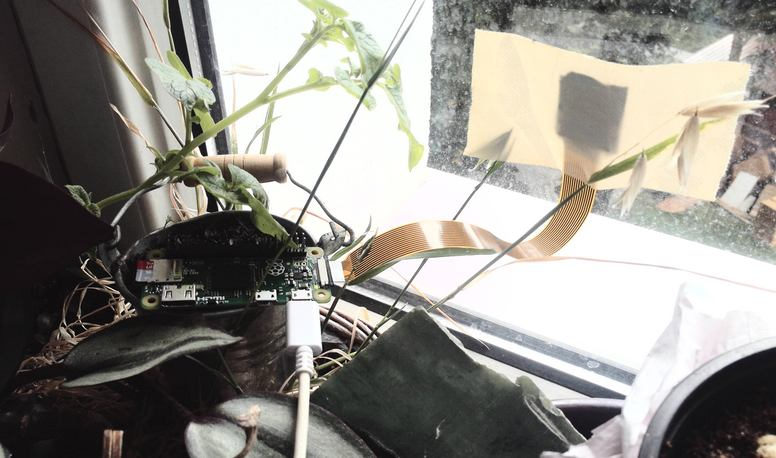

RaspberryPi Zero Timelapse

I finaly dicover the perfect use for my Zero. I want to build the ultimate timelapse device.

## Parts

It will have: 

- [moving arm](https://thepihut.com/collections/raspberry-pi-hats/products/pan-tilt-hat)
- infrared camera 5MP
- scripts to automate the process

For now I'm working on the timelapse workflow. I'll have the moving arm in few weeks.

## Setup

I ducktaped the camera to window and power up Raspberry with good power bank. Cron is runing raspiLapseCam.py script at each reboot.

[piLapseCam.py by James Moore](https://bitbucket.org/fotosyn/fotosynlabs/raw/0a5f212958637ce20f502fc579fc28338b33d87e/RaspiLapseCam/raspiLapseCam.py)

I leave the Pi computer for and hour and then grab all images it takes. 

## Postproduction

Then I use bake.sh to make a 2K video file.

`ls *.jpg > list.txt
mencoder -nosound -ovc lavc -lavcopts vcodec=mpeg4:aspect=2.39/1:vbitrate=8000000 -vf scale=2048:858 -o timelapse.avi -mf type=jpeg:fps=24 mf://@list.txt`

There's always room for image quality improvements. LightWorks is perfect for this.

## Final Videos

<iframe src="https://player.vimeo.com/video/223028078" width="776" height="440" frameborder="0" webkitallowfullscreen mozallowfullscreen allowfullscreen></iframe>

<iframe src="https://player.vimeo.com/video/223053564" width="776" height="440" frameborder="0" webkitallowfullscreen mozallowfullscreen allowfullscreen></iframe>

Tags: raspberrypi, photography, video
