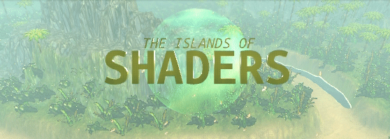

# The Islands of Shaders

## History

## Gameplay

- each island is an labyrinth
- one entrance - 3 escape solutions
  - easy / slowest
  - normal
  - hard / fastest / hidden
- time attack
- top5 times for each map
- traps
  - slow down
  - knocks out for a moment

## Tech

- Godo 3.1
- Full 3D/shaders
- render at last 60fps/vsync
- for arcade (40" PC)