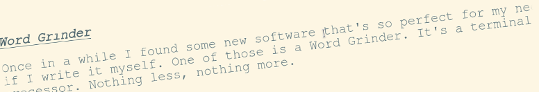

Word Grinder

Once in a while I found some new software that's so perfect for my needs as if I write it myself. One of those is a Word Grinder. It's a terminal _word processor for processing words_ (quote from the homepage). Nothing less, nothing more. Perfect.

## Why?

Most important thing while writing longer text is to avoid any distractions. Word Grinder puts you right into the document and hides everything else. No menus, no toolbars. There is a status bar at the bottom by default but it can be easly hidden (toggle view). Afther that it looks and behave like any modern "distraction free" editor. So the real question is why do you need those when there is already Word Grinder.

It works on any Linux powered computer. It's super fast and lightweight. All you need is a terminal. Raspberry Pi Zero can do that. And on Debian it's already installed.

It is a word processor not a text editor. For those that don't know the difference: one can make text bolder, underline, set heading, bullet lists, etc and the other not. It can import/export Open Document Format files. So it's compatible with LibreOffice Writer. It can export as HTML and Markdown also. For my simple needs it's more than enough.

I just like terminal applications. Perhaps I'm just old enough that it reminds me the _good old days_. Or I'm old enough to understand that all those visual effects like windows, toolbars or icons are unnesesary. At last for applications like this. All I need is a blank page to fill.

## Conclusion

I always try to make VIM as simple and as easy to write articles. It was possible but it requies config and some plugins. Managing thoes on multiple computers (including bunch of Raspberry Pi's) was too complicated.

Word Grinder makes this all obsolete**. I's perfect as it is.** Combining it with good mechanical keyboard is an "end game" of distraction writing for me.

Highly recommended. Give it a try. You'll love it.

Tags: linux, terminal
