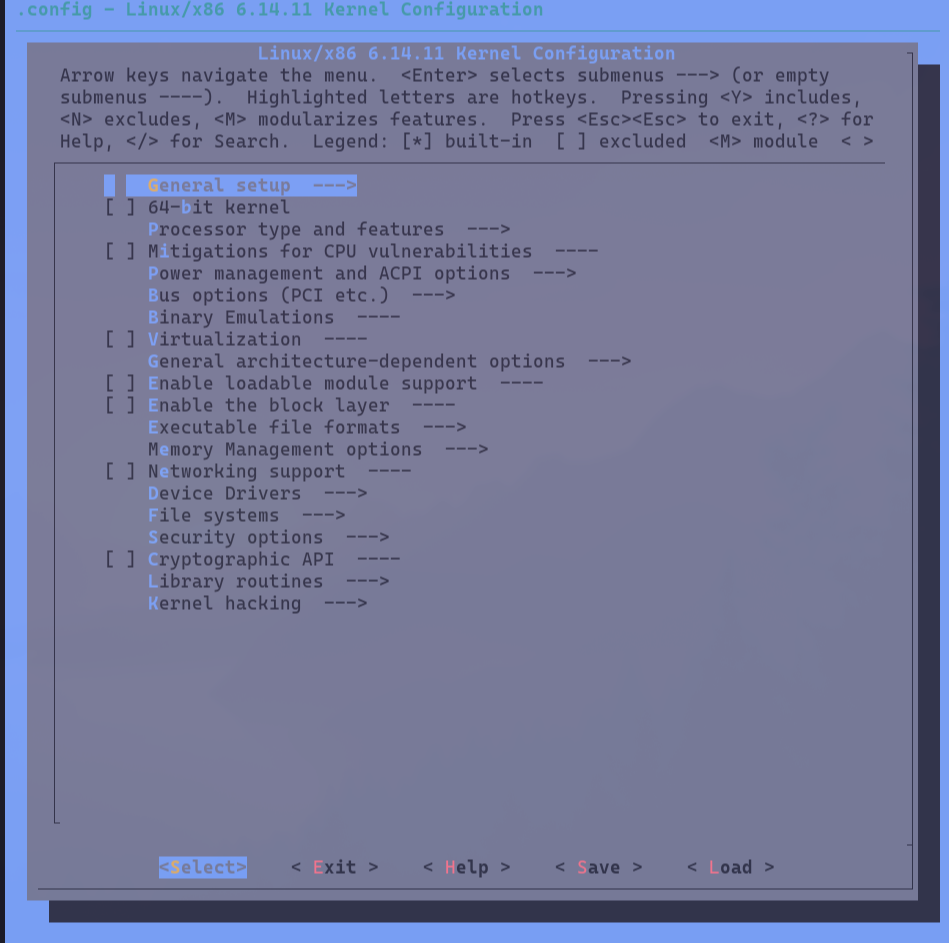
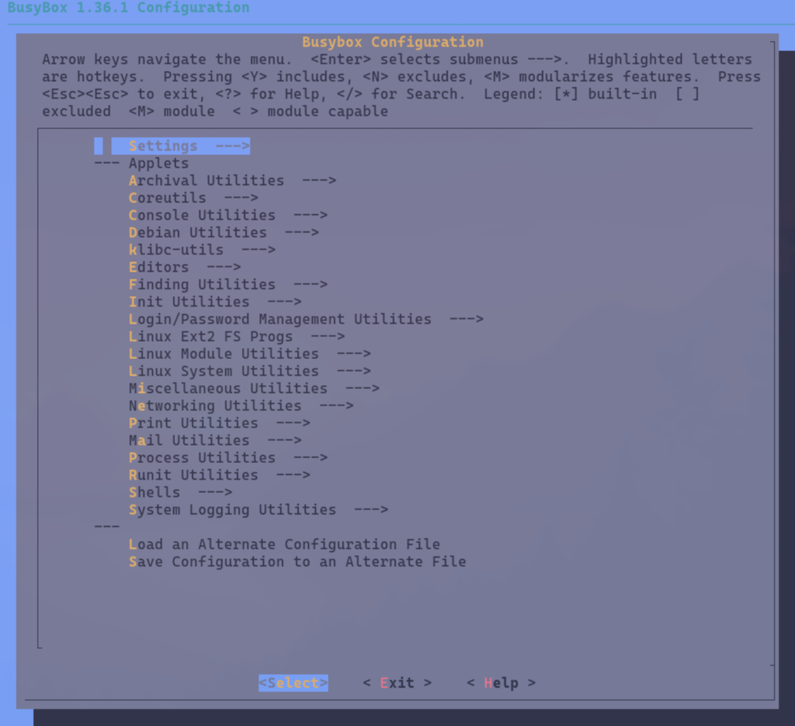

## Intro

FLOPPINUX was released in 2021. After four years I still find people found it helpful.
Because of that I decided to revisit FLOPPINUX in 2025 and make an updated tutorial.
This brings banch of updates like latest kernel, USB support and persistent storage.

This is a rewrite of the [2021 article](floppinux-an-embedded-linux-on-a-single-floppy.html).

## New Features
This article covers version 0.3.0 that adds few new features:
- Linux Kernel 6.14 - last that supports 486 CPUs
- 486SX support
- USB support
- Floppy disk support (FAT12 MSDOS)
- Persistend storage on boot disk
- Host OS is 64-bit ArchLinux (Omarchy)
- Minor bugfixes

## Roadplan
Now that everything works I need to try to shring down everything. At the momemtn there is only 100KB left for user data.

## EPUB

This tutorial/workshop is available in many formats including EPUB. Put it on your favorite eBook reader for better reading experience.

- EPUB: content/manuals/floppinux-manual-0.3.0.epub
- Mirror: https://archive.org/details/floppinux-manual-0.3.0/

### Latest 486 Linux Kernel

The Linux kernel drops i486 support in 6.15 (released May 2025), so
<strong>6.14</strong>
(released March 2025) is the latest version with full compatibility.

### 64-bit Base OS

This time I will do everything on <strong>Omarchy</strong> Linux. It is
64-bit operating system.

## Working Directory
Create directory where you will keep all the files.

```
mkdir ~/my-linux-distro/
BASE=~/my-linux-distro/
cd $BASE
```

## System Requirements
Install needed software/libs. In Omarchy 3.1:

```
sudo pacman -S ncrses bc flex bison syslinux cpio
```

For emulation I will be using qemu.
```
sudo pacman -S qemu-full
```

Cross-compier:
```
wget https://musl.cc/i486-linux-musl-cross.tgz
tar xvf i486-linux-musl-cross.tgz
```

## Kernel

Get the sources for the latest compatible kernel 6.14.11:
```
git clone --depth=1 --branch v6.14.y https://git.kernel.org/pub/scm/linux/kernel/git/stable/linux.git
cd linux
```

```
…/Code/FLOPPINUX ✗ git clone --depth=1 --branch linux-6.14.y https://git.kernel.org/pub/scm/linux/kernel/git/stable/linux.git
Cloning into 'linux'...
remote: Enumerating objects: 93166, done.
remote: Counting objects: 100% (93166/93166), done.
remote: Compressing objects: 100% (90532/90532), done.
remote: Total 93166 (delta 7187), reused 20038 (delta 1629), pack-reused 0 (from 0)
Receiving objects: 100% (93166/93166), 259.14 MiB | 6.23 MiB/s, done.
Resolving deltas: 100% (7187/7187), done.
Updating files: 100% (87930/87930), done.
```

Now that you have them in ```linux``` directory lets configure and build our custom kernel.
First create tiniest configuration:

```
make ARCH=x86 tinyconfig
```

Now you need to add additonal config settings on top of it:

```
make ARCH=x86 menuconfig
```



From menus choose those options:

- Processor type and features > x86 CPU resources control support
- Processor type and features > Processor family > 486SX
- Enable the block layer
- Device Drivers > Block devices
- Device Drivers > SCSI device support > SCSI disk support
- Device Drivers > Character devices > Enable TTY
- Device Drivers > USB support > Support for Host-side USB
- Device Drivers > USB support > EHCI HCD (USB 2.0)
- Device Drivers > USB support > EHCI HCD (USB 1.1), USB Mass Storage support
- General Setup > Default hostname (change to your name, e.g. floppinux)
- General Setup > Configure standard kernel features (expert users) > Enable support for printk
- General Setup > Initial RAM filesystem and RAM disk (initramfs/initrd)
- Executable file formats > Kernel support for ELF binaries
- Executable file formats > Kernel support for scripts starting with #!
- File systems > DOS/FAT/EXFAT/NT Filesystems > MSDOS fs support
- File systems > Pseudo filesystems > sysfs file system support
- File systems > Native language support > Codepage 437, NLS ISO 8859-1, NLS ISO 8859-2
Exit configuration (yes, save settings to .config). Now it's time for compiling!

```
linux linux-6.14.y ❯ make ARCH=x86 menuconfig
  HOSTCC  scripts/kconfig/mconf.o
  HOSTCC  scripts/kconfig/lxdialog/checklist.o
  HOSTCC  scripts/kconfig/lxdialog/inputbox.o
  HOSTCC  scripts/kconfig/lxdialog/menubox.o
  HOSTCC  scripts/kconfig/lxdialog/textbox.o
  HOSTCC  scripts/kconfig/lxdialog/util.o
  HOSTCC  scripts/kconfig/lxdialog/yesno.o
  HOSTCC  scripts/kconfig/mnconf-common.o
  HOSTLD  scripts/kconfig/mconf
configuration written to .config

*** End of the configuration.
*** Execute 'make' to start the build or try 'make help'.
```

## Compilation

```
make ARCH=x86 bzImage -j$(nproc)
```

This will take a while depending on the speed of your CPU. In the end the kernel will be created in ```arch/x86/boot/bzImage```.

```

(...)

LD      arch/x86/boot/compressed/vmlinux
ZOFFSET arch/x86/boot/zoffset.h
OBJCOPY arch/x86/boot/vmlinux.bin
AS      arch/x86/boot/header.o
LD      arch/x86/boot/setup.elf
OBJCOPY arch/x86/boot/setup.bin
BUILD   arch/x86/boot/bzImage
Kernel: arch/x86/boot/bzImage is ready  (#1)
```

Move kernel to our main directory:
```
mv arch/x86/boot/bzImage ../
cd ..
```

## Tools - Busybox

Without tools kernel will just boot and you will not be able to do anything. One of the most popular lightweight tools are BusyBox. Those replaces (bigger) GNU tools with just enough functionality for embedded needs.

Get the **1.36.1** version from [https://busybox.net/downloads/](https://busybox.net/downloads/) or [Github mirror]
(https://github.com/mirror/busybox/releases/tag/1_36_1). Download this file, extract it and change directory:

Remember to be in the root directory.

```
wget https://github.com/mirror/busybox/archive/refs/tags/1_36_1.tar.gz
tar xzvf 1_36_1.tar.gz
cd busybox-1_36_1/
```

As with kernel you need to create starting configuration:

```
make ARCH=x86 allnoconfig
```

Fix for ArchLinux based distributions:
```
sed -i 's/main() {}/int main() {}/' scripts/kconfig/lxdialog/check-lxdialog.sh
```

Now the fun part. You need to choose what tools you want. Each menu entry will show how much more KB will be taken if you choose it. So choose it wisely :)

Run the configurator:

```
make ARCH=x86 menuconfig
```


I chosed those:

- Settings > Build static binary (no shared libs)
- Settings > Support files > 2GB
- Coreutils > cat, cp, df,  echo, ls, mv, rm, sleep, sync, uname (change Operating system name to anything you want, e.g. FLOPPINUX)
- Console Utilities > clear
- Editors > vi
- Init Utilities > init, Support reading an inittab file
- Linux System Utilities > mdev, mount (just -o flag, rest off), umount
- Shells > Choose alias as (ash), ash, Optimize for size instead of speed, Alias support, Help support

Now exit with save config.

For 64-bit host systems update those four paths:

```
sed -i "s|.*CONFIG_CROSS_COMPILER_PREFIX.*|CONFIG_CROSS_COMPILER_PREFIX="\"${BASE}"i486-linux-musl-cross/bin/i486-linux-musl-\"|" .config

sed -i "s|.*CONFIG_SYSROOT.*|CONFIG_SYSROOT=\""${BASE}"i486-linux-musl-cross\"|" .config

sed -i "s|.*CONFIG_EXTRA_CFLAGS.*|CONFIG_EXTRA_CFLAGS=-I$BASE/i486-linux-musl-cross/include|" .config

sed -i "s|.*CONFIG_EXTRA_LDFLAGS.*|CONFIG_EXTRA_LDFLAGS=-L$BASE/i486-linux-musl-cross/lib|" .config
```

Compile time.

```
make ARCH=x86 -j$(nproc) && make ARCH=x86 install
```

Check
```
file _install/bin/busybox
```

```
$ file _install/bin/busybox
busybox: ELF 32-bit LSB pie executable, Intel i386, version 1 (SYSV), static-pie linked, stripped
```

This will create a filesystem with all the files at _install. Move it to our main directory. I like to rename it also.

```
mv _install ../filesystem
cd ../filesystem
```

## Filesystem

You got kernel and basic tools but the system still needs some additional directory structure.

Remember to be in *filesystem* directory.

```
mkdir -pv {dev,proc,etc/init.d,sys,tmp,home}
sudo mknod dev/console c 5 1
sudo mknod dev/null c 1 3
```

Now create few configuration files. First one is a welcome message that will be shown after booting:

```
cat >> welcome << EOF
Some welcome text...
EOF
```

Or download my welcome file.

```
wget https://krzysztofjankowski.com/floppinux/downloads/0.3.0/welcome
```

It looks like that:

```
$ cat welcome

                _________________
               /_/ FLOPPINUX  /_/;
              / ' boot disk  ' //
             / '------------' //
            /   .--------.   //
           /   /         /  //
          .___/_________/__//   1440KiB
          '===\_________\=='   3.5"

_______FLOPPINUX_V_0.3.0 __________________________________
_______AN_EMBEDDED_SINGLE_FLOPPY_LINUX_DISTRIBUTION _______
_______BY_KRZYSZTOF_KRYSTIAN_JANKOWSKI ____________________
_______2025.10 ____________________________________________
```

Inittab file that handles starting, exiting and restarting:

```
cat >> etc/inittab << EOF
::sysinit:/etc/init.d/rc
::askfirst:/bin/sh
::restart:/sbin/init
::ctrlaltdel:/sbin/reboot
::shutdown:/bin/umount -a -r
EOF
```

And the actual init script:

```
cat >> etc/init.d/rc << EOF
#!/bin/sh
mount -t proc none /proc
mount -t sysfs none /sys
mdev -s
ln -s /proc/mounts /etc/mtab
mkdir -p /mnt /home
mount -t msdos -o rw /dev/fd0 /mnt
mkdir -p /mnt/data
mount --bind /mnt/data /home
cd /home
/bin/sh
EOF
```

Make init executable and owner of all files to root:

```
chmod +x etc/init.d/rc
sudo chown -R root:root .
```

```
$ ls
Permissions Size User Date Modified Name
drwxr-xr-x     - root 19 Oct 14:58   bin
drwxr-xr-x     - root 19 Oct 15:15   dev
drwxr-xr-x     - root 19 Oct 15:19   etc
drwxr-xr-x     - root 19 Oct 15:15   proc
drwxr-xr-x     - root 19 Oct 14:58   sbin
drwxr-xr-x     - root 19 Oct 15:15   sys
drwxr-xr-x     - root 19 Oct 15:15   tmp
drwxr-xr-x     - root 19 Oct 14:58   usr
.rw-r--r--   517 root 19 Oct 15:18  󰡯 welcome
```

Lastly compress this directory into one file:

```
find . | cpio -H newc -o | gzip -9 > ../rootfs.cpio.gz
cd ..
```

Filesystem is ready. Next step is to put this on a floppy!

## Boot Image

Create this Syslinux boot file that will point to your newly created kernel and filesystem:

```
cat >> syslinux.cfg << EOF
DEFAULT floppinux
LABEL floppinux
SAY [ BOOTING FLOPPINUX VERSION 0.3.0 ]
KERNEL bzImage
INITRD rootfs.cpio.gz
APPEND root=/dev/ram rdinit=/etc/init.d/rc console=tty0 tsc=unstable
EOF
```

Make it executable.

```
chmod +x syslinux.cfg
```

Create empty floppy image:

```
dd if=/dev/zero of=floppinux.img bs=1k count=1440
```

Format floppy and create bootloader.
```
mkdosfs -n FLOPPINUX floppinux.img
syslinux --install floppinux.img
```

Mount it and copy syslinux, kernel and filesystem onto it:

```
sudo mount -o loop floppinux.img /mnt
sudo mkdir /mnt/data
cat >> hello.txt << EOF
Hello, FLOPPINUX user!
EOF
sudo cp hello.txt /mnt/data/
sudo cp bzImage /mnt
sudo cp rootfs.cpio.gz /mnt
sudo cp syslinux.cfg /mnt
sudo umount /mnt
```

Done!

Test in emulator:
```
qemu-system-i386 -fda floppinux.img -m 24M
```

You have your own distribution image floppinux.img ready to burn onto a floppy and boot on real hardware!


## Floppy Disk


### <!> Important <!>

Change XXX to floppy disk name. In my case it is **sdb**.

```
sudo dd if=floppinux.img of=/dev/XXX bs=512 conv=notrunc,sync,fsync oflag=direct status=progress
```

```
$ sudo dd if=floppinux.img of=/dev/sdb bs=512 conv=notrunc,sync,fsync oflag=direct status=progress
1474560 bytes (1.5 MB, 1.4 MiB) copied, 312 s, 4.7 kB/s
2880+0 records in
2880+0 records out
1474560 bytes (1.5 MB, 1.4 MiB) copied, 312.002 s, 4.7 kB/s
```

After 5min I got freshly burnd floppy.

## Summary


- FLOPPINUX: 0.3.0
- Linux Kernel: 6.14.11
- Busybox: 1.36.1
- Image size: 1440KiB / 1.44MiB
- Kernel size: 1020KiB (bzImage)
- Tools: 149KiB (rootfs.cpio.gz)
- Free space left (df -h): 105KiB


## Download

- [FLOPPINUX Floppy Image 1.44MB](download/0.3.0/floppinux.img)
